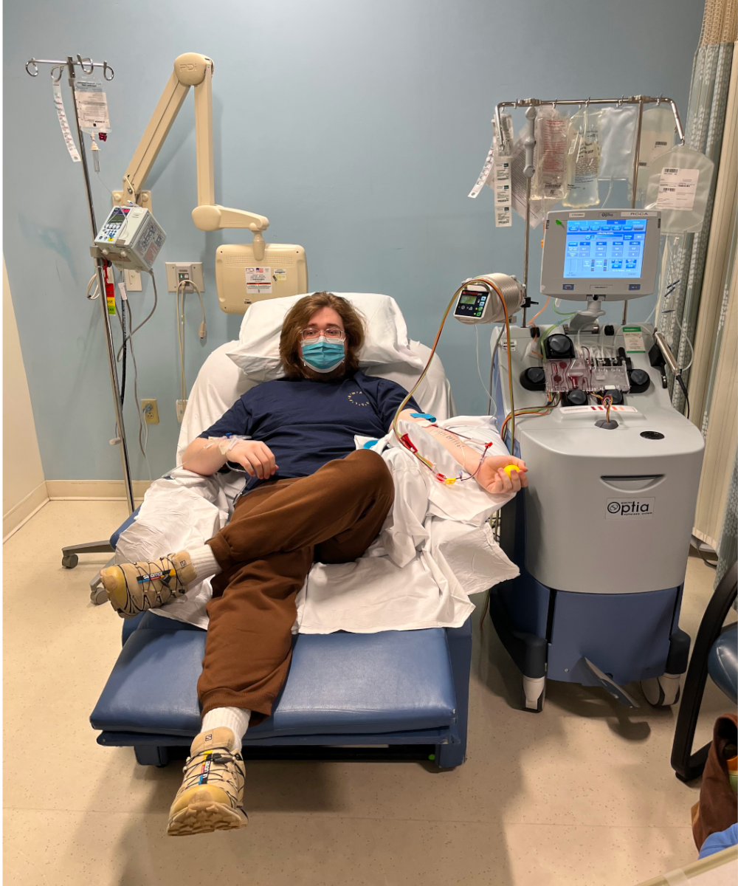

 In the fall of 2023, there was a van on my college campus handing out free paninis. All you had to do was a quick mouth swap for Be The Match (now NMDP - but I like the original name more). As a college student, I of course would rather have a free meal than a financed one, so I rub the cotton swab around my mouth, put it in its little container, and hand it back to the Be The Match folks. About a year later I get a call that I am a match for an individual with leukemia. After over a weeks worth of G-CSF injections to increase my stem cell count, I traveled a few hours to a facility that they could preform the donation by filtering out all of my peripheral "good stuff". The actual donation only took about 3 hours of what I was told would be a 4 - 6 hour process. They probably have a fully redacted plaque of me hung up in that building, cause I defiantly set a record.

Ive gotten pretty used to needles in part because of this experience. I remember when I was very young I had to be restrained by 3 people in order to get my flu shot, but not anymore, if that was the case I would need a bakers dozen at the minimum. I also got the chance to do a blood donation at NEB in 2025 where I found out I am the universal donor, so I have also been doing blood donations as well, even more so reducing that fear of needles. Now Im one of those guys that requests to see the bag as it is filling up, and when I got a really bad cut that required 13 stitches, I was the guy that watched the entire thing happen. Its such an interesting process to me, my blood is going right into a bag that will then be hooked up to someone else.

For the record, I know my hair is insane in this photo. This was about a year or twos worth of growth with a total of 2 hair cuts along that span. I solved that problem within an hour of coming back to Worcester from this donation. I shaved my head all the way down to the scalp. One of my good friends had also been going through chemotherapy at the time, so me and another friend all shaved out heads together. I hope it was somewhat therapeutic to rid someone else of their hair.

And I did it all for a free panini.  

               
wow.  
you scolled pretty far.  
for that you get:  

**BALD BONUS!!!**

