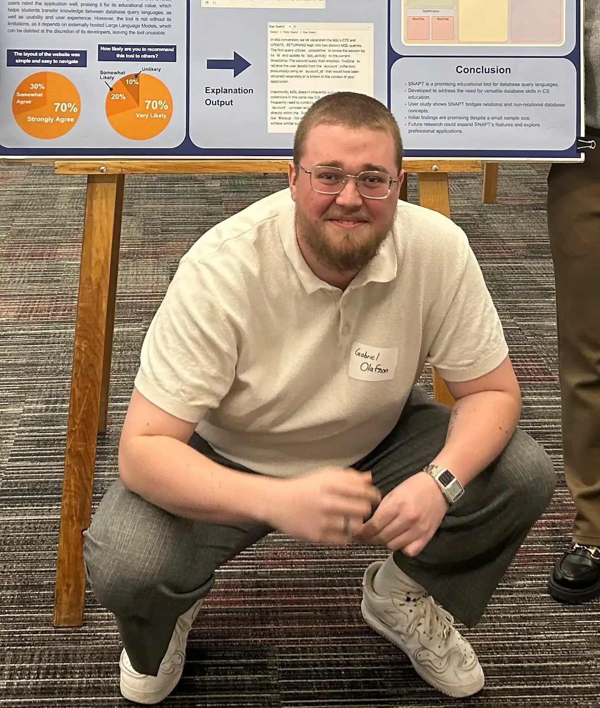

 
 In the fall of 2023, there was a van on the WPI campus handing out free paninis. All that was required was a mouth swab for Be The Match (now NMDP). As a college student, I of course chose a free meal over a financed one. I rubbed the cotton swab around my mouth, and handed it back to the Be The Match folks. I quickly replenished my, now dehydrated mouth, with a big bite of chicken panini.  

Approximately one year later I got a call that I was a match for an individual with leukemia. After over a week's worth of G-CSF injections (to increase my stem cell count), I showed up for my donation which took half the time that was expected due to my high blood volume.

I also got the opportunity to take part in a blood drive while interning at New England Biolabs in 2025 where I found out I am a universal donor, so I have been doing frequent blood donations since then as well. 

For the record, I also solved my inefficient aerodynamics problem upon returning to Worcester from this donation. Within an hour of returning I shaved my head down to the scalp in solidarity with a friend going through chemo.

And I did it all for a free panini.

               
wow.  
you scolled pretty far.  
for that you get:  

**BALD BONUS!!!**

