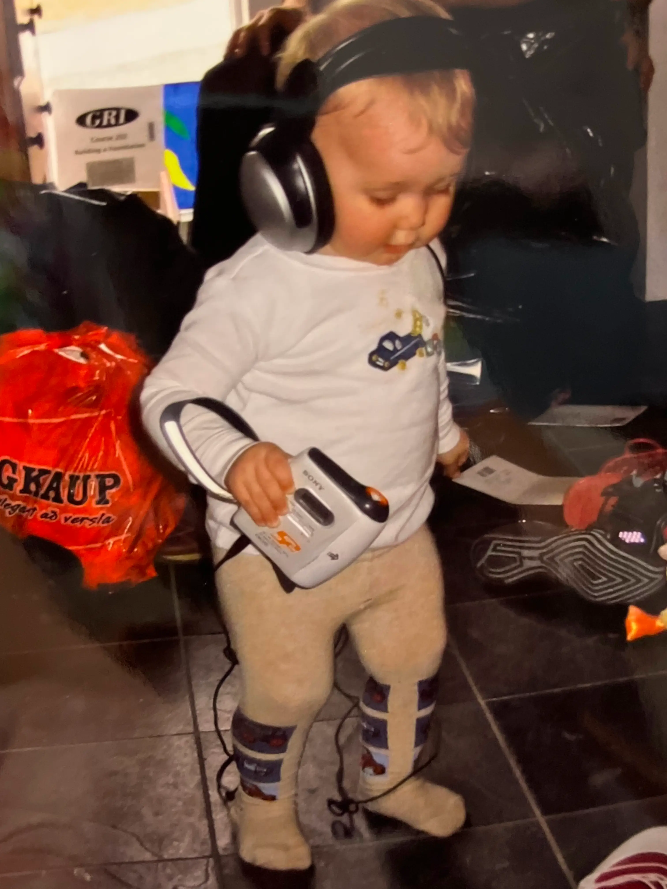

The first IPod that I ever used I stole from my dad. It was in the bottom of a bin of wires, buried under other old tech. Some of that old tech I have used for other things as well, for example one of his old computers (lovingly named "UTER" as it is a dell laptop from 2008 running windows 11, its not a very COMPetent compUTER) has a CD/RW drive, so it has been converted into my dedicated machine for cd ripping and burning, which is how I get flac files => cd quality mp3s => Music (rip iTunes) => IPod  

##### Mini Green Monster - 128g:
At some point in my modding of this IPod I misplaced all of the screws that would keep it together. Thinking on my feet, I temporarily used a piece of electrical tape to keep it from falling apart. That temporary solution was deployed in May 2025 and is still holding strong. The battery in this ipod is very small and can not hold a charge for too much longer than a day, so I really only use it in the house. I typically have it plugged into my stereo system that is a mix of some speakers I found on the side of the road, speakers that my dad had no use for anymore (out of another one of his piles), and equipment that I was handed down from my grandparents when they upgraded from their 5 cd player (it is awesome and I use it everyday) + amp.  
##### Parent Pod - 512g:
Guess where I got this one. It is engraved with my parents' names on the back. This one means a lot to me as it was the iPod that my parents literally shared when I was barely old enough to read. And if the timeline doesn't make any sense to you, I may have been a little late to the whole "reading" thing.
The first thing I did to the Parent Pod was upgrade the storage. I got an IFlash Quad board and filled it with two 256g micro sd cards. If your math is good, you know that I could upgrade to a teribyte... and that might be something I am planning on doing in the future ;]. The battery also needed to be swapped and I chose the largest that could fit in the 60g base model (the 30g and 60g iPod 5th Gens are slightly thicker than the 80g model), a 3000mAmp battery. The battery literally lasts weeks. The screen had some dead pixels, that's an undersell, it was about 5% of the entire screen that was dead, so that needed to be replaced. The audio only came out of the right channel so the aux port also had to be changed out. Everything clips into place on the 5th Gen, so no need for the electrical tape this time.  