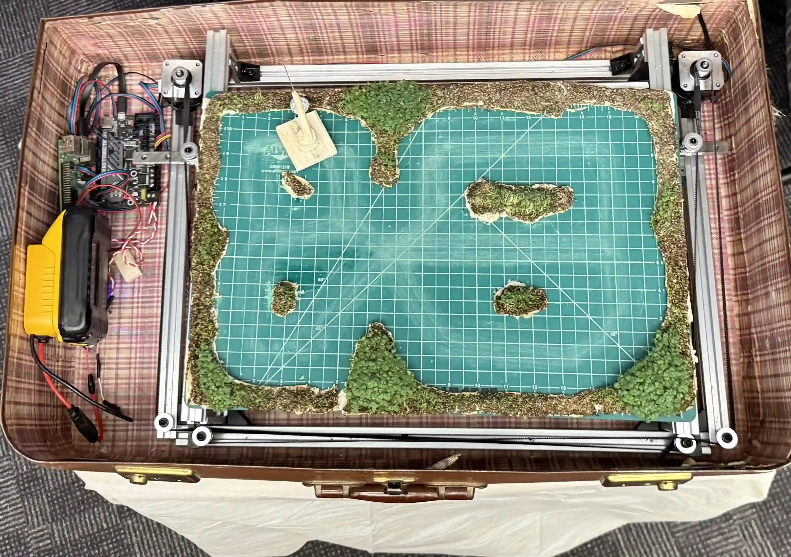
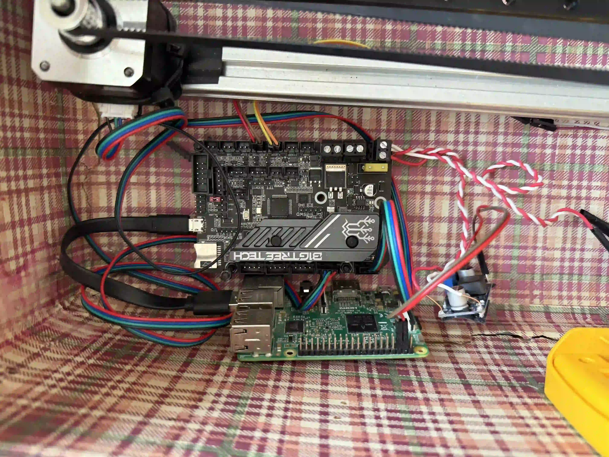
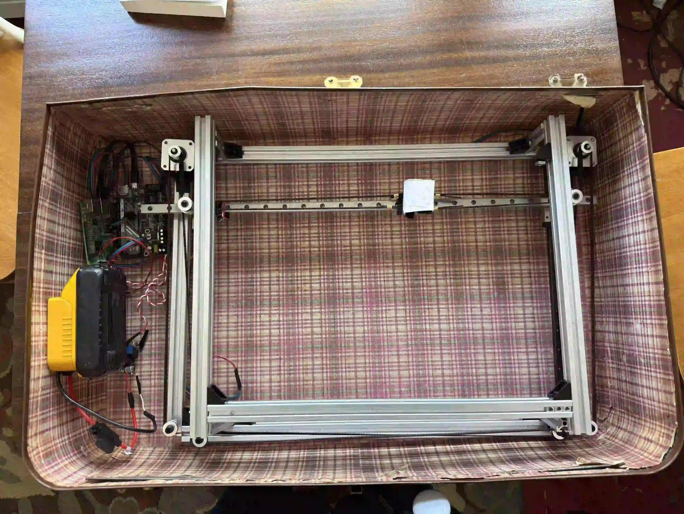
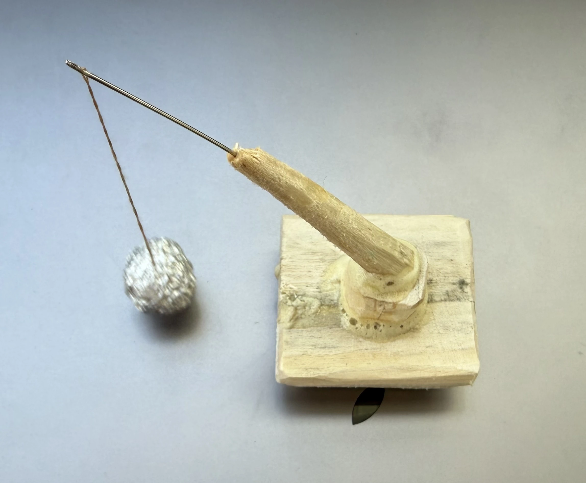

As a computer science major, all I know is creating code that changes pixels on a screen. In past projects, I have found it to be almost impossible to be satisfied with the things that I have created when it is so easy to push just a few more line of code to make it that little bit better. I wanted to make something tangible that challenged me to put my engineering skills to work, something that I could be proud of. I now somewhat resent the field that I once loved, and just in time to receive my degree. The damage that corporations that lead in this field have done so much damage. “Move fast and break things” is not a righteous way to run a business. So much damage has been done to the environment ([2](#2)), of which I reference directly in this piece. They have also distilled our trust in things we once considered ground truth, the changes in how we as humans communicate, plus they don't pay their share of taxes ([4](#4)), just to name a few.

The concept came naturally from this frustration, if computer science is consuming the physical world through data centers, deforestation, and ecological damage, I wanted to make something that forced that consumption to be visible and present. I wanted this piece to show this precarious relationship between nature and technology.

The first thing that I started to work on was the electronics. I got a few 20V DeWalt batteries that needed to be stepped down for the other components I had acquired. I needed 12V for my SKR board that provided silent movement of the motors and logic of the movement via a CoreXY 1 configuration. I also needed to step down to 5V from there in order to power the raspberry pi running that sends the commands via a python library to the SKR and has all of my code for the positioning of the head on it ([_fig 2_](#fig-2)). 

##### _Fig 1_

Once the components where proved to be functional and this idea viable, I built out the frame from 2020 aluminum. Inside of this frame there needed to be support to maintain smooth motion. For the y support, I used two 400mm guide rails attached to the frame at the max x and min x. For x support I attached a 600mm guide rail directly to the two 400mm rails. On top of the 600mm rail I placed a magnet on top of 4 screws, just tall enough to be able to hold a magnet thru the sewing mat. Then the stepper motors where secured to the frame and so were the the supports for the [CoreXY setup](https://corexy.com/theory.html). Next was to get the CoreXY set up and functional. A belt was ran thru as per the documentation ([1](#1)) calls for and it all attached to the head. Finally for this frame I made the support for the sewing mat, just enough distance so that the powerful rare earth magnets would be close enough to glide across the surface ([_fig 2_](#fig-2)).

##### _fig 2_

While I was building out the frame, I was planning the Chia seeds so that they would grow in the time before the showcase for about 2 weeks. I placed paper towel across the entire sewing mat, dampened it all, and carefully placed chia seeds in the general area that I wanted them to grow. This was not my first time growing chia seeds but it was the biggest scale I have ever tried it at, this one having to be sprayed with water multiple times per day instead of having a greenhouse effect as it was too large for any of my containers. When the chia had rooted itself for about a week I cut out all of the paper that did not have any chia on it and tucked it the rest under growth and glued down the islands. 

Finally it came time to code. I manually went thru and map out the x and y values of every single “decision point” (a change in direction is required), and then used the function I created called add Connections to add a list of other points that this point can directly travel to, requiring at least two connections. I used Object Oriented Programming for all of the Position objects so I decisions were made inside of the object itself on where to go next. I specifically made this code that this it would not double back on itself and only travel forward. This was achieved by keeping track of where the last location the head traveled from was and not having that be a choice to go to. When there is more than 2 locations to go to, it will randomly choice from all the locations that were not where it just came from. The code has been uploaded to my [github]().

The last physical element I built was the figure itself ([_fig 3_](#fig-3)) a small form whittled from wood, with a sewing needle arm and a ball of aluminum foil serving as the wrecking ball. It was very simple, but it carried the most meaning, and made the entire piece feel more alive with the constant swaying of the ball, hitting the chia seeds every step along the way.

##### _fig 3_:

In the last few hours of the final showcase I ran my suitcase for about an hour with 80 grit sandpaper glued to a magnet. This was so that I could show the wear patterns of the path that was created and show the little bit of variance in its path that was programmed into the RasPi’s motion logic.

Seeing my piece running at the showcase was the most proud of something I had made at this university. There was no chance to change it, it was complete and nothing more could be tweaked. The chia was alive, the figure with the wrecking ball was moving was moving, and people were stopping to watch it. Personally I was mesmerized for a good 20 minutes just watching it go around and watching the wrecking ball swing and hitting the chia seeds. There is something deeply satisfying about making a thing that exists in the world, and does not just live in the cloud, on one of those aforementioned data centers.

### Footnote:
For my very final required course at WPI, I was in a class called "multimedia art in a suitcase". This was my final course at WPI, and the reason I could not graduate a semester early. At first I was really frustrated that there was nothing to fill this graduation requirement until my final semester, even though by this point I had already taken 2 more courses than were required to graduate. I chose to take advantage and ended up very much appreciating this additional semester as it gave me the chance to go deeper into topics I had been able to yet as I was focusing on diploma requirements, such as music theory, philosophy, CAD, and another electrical engineering course. 

### Sources:
#### 1. “CoreXY | Cartesian Motion Platform.” n.d. Corexy.com. [https://corexy.com/theory.html](https://corexy.com/theory.html).
#### 2. Benn Jordan. 2026. “Datacenters Behaving like Acoustic Weapons.” YouTube. February 18, 2026. [https://www.youtube.com/watch?v=_bP80DEAbuo](https://www.youtube.com/watch?v=_bP80DEAbuo).
#### 3. “More Data Centers, More Environmental Problems?” 2025. National Wildlife Federation. 2025. [https://www.nwf.org/Magazines/National-Wildlife/2025/Fall/Conservation/AI-Data-Centers](https://www.nwf.org/Magazines/National-Wildlife/2025/Fall/Conservation/AI-Data-Centers).
#### 4. Gardner, Matthew, and Spandan Marasini. 2026. “At Least 88 Profitable U.S. Corporations Paid Zero Federal Income Tax in 2025.” ITEP. Institute on Taxation and Economic Policy (ITEP). April 14, 2026. https://itep.org/88-profitable-corporations-paid-zero-income-tax-in-2025/.
